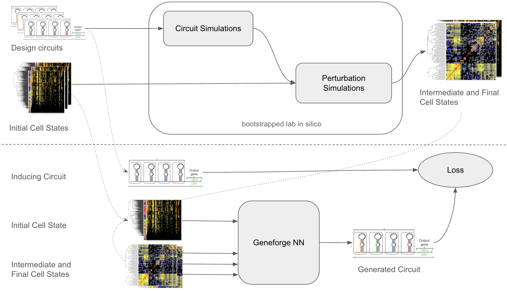

# GeneForge: Generative AI for Genetic Circuit Design

## Overview

GeneForge is a project aimed at developing a robust framework for generating and modeling genetic circuits. The ultimate goal is to create a model capable of designing and editing genetic circuits given an initial and target cell states (e.g. from RNA-seq data). This project encompasses several steps, including data collection, model training, and circuit and expression perturbation simulation.



## Project Structure

```plaintext
├── src/
│   ├── circuits/     # for generating circuits
│   ├── data/         # for downloading and processing datasets
│   ├── repositories/ # for interacting with parts repos
│   ├── train/        # training scripts
├── notebooks/
├── docs/             # references and background material
├── .gitignore
├── README.md
├── requirements.txt
```

## Goals
Develop a Generative Model for Genetic Circuit Design:

- Train models to learn and generate valid genetic circuits using parts repositories such as SynBioHub and iGEM and language modeling techniques.
- Validate the ability to model and generate valid circuits.

Generate Circuits Based on Initial and Target Cell States:

- Use expression data (e.g., RNA-seq) to design genetic circuits that transition a cell from an initial expression state to a target expression state.
- Generate a large quantity of pseudo-random circuit design.
- Combine circuit design simulations (e.g. libSBML) with perturbation simulations (e.g., GEARs, GeneFormer).
 
## Installation
Clone the Repository:
```
git clone https://github.com/yourusername/geneforge.git
cd geneforge
```
Install Dependencies:

```sh
pip install -r requirements.txt
```

## Usage
Data Preprocessing:

Normalize and standardize genetic circuit data.
Extract descriptions and structure the data for model training.
```
python src/data/pipeline.py
```
Model Training:

Train models for genetic circuit design and masked component modeling.
```
python src/train/training_circuit_from_description.py
python src/train/training_masked_component_modeling.py
```

## References and Background Material

A bibliography of related publications can be found {root}/docs/bibliography.txt

## Future Work
- Integrate context into part defintions by using embeddings from part descriptions as model input.
- Learning/tuning scheme for component parameters optimization (e.g. binding constants, degradation and production rates)
- Experiment with graph representations of circuits and GNNs.
- Script to convert simplified json circuit to SBOL.
- Integrate additional datasets from other repositories and collections.
- Implement circuit simulations and validate conversion of SBOL to SBML.
- Pipe circuit simulation outputs into perturbation-seq simulation as inputs.
- From simualtions, derive a dataset of sample (circuit + intitial cell state + final cell states).
- Use derived dataset to train circuit generation conditioned on initial and desired cell state.
